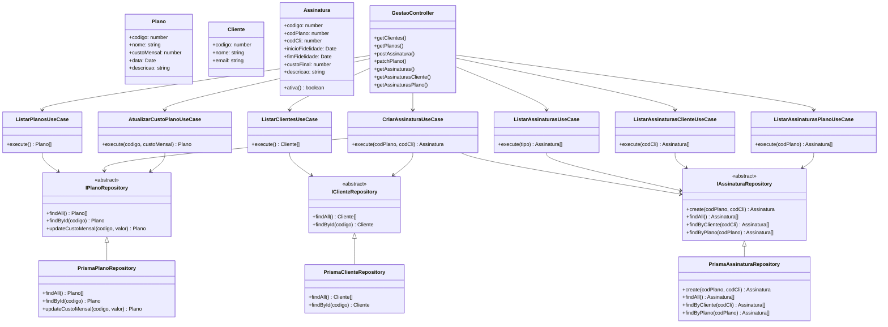

# Relatório de Arquitetura — ServicoGestao
**Desenvolvimento de Sistemas Back-End — Fase 1**
**Aluno:** Andreas Berwaldt
**Data:** Maio de 2026

---

## 1. Descrição do Projeto

O **ServicoGestao** é o serviço principal de um sistema destinado a operadoras de internet para gerenciar planos e assinaturas de clientes. Ele expõe uma API REST que permite:

- Listar clientes e planos cadastrados
- Criar assinaturas vinculando um cliente a um plano
- Atualizar o custo mensal de um plano
- Listar assinaturas com filtros (todas, ativas ou canceladas)
- Listar assinaturas de um cliente específico
- Listar assinaturas de um plano específico

O serviço foi implementado em **TypeScript** com **NestJS**, banco de dados **PostgreSQL** via **Prisma ORM (v7)**, seguindo os preceitos da **Arquitetura Limpa** proposta por Robert C. Martin.

---

## 2. Diagrama UML de Classes



---

## 3. Organização segundo a Arquitetura Limpa

A Arquitetura Limpa de Robert C. Martin organiza o sistema em camadas concêntricas onde as dependências sempre apontam para dentro (em direção ao domínio). O projeto está estruturado em quatro camadas:

```
servico-gestao/src/
├── domain/               # Camada mais interna — regras de negócio
│   ├── entities/         # Entidades do domínio
│   └── repositories/     # Contratos abstratos (interfaces)
├── application/          # Casos de uso — orquestração do negócio
│   └── use-cases/
├── infrastructure/       # Detalhes externos — banco de dados
│   ├── database/         # PrismaService
│   └── repositories/     # Implementações concretas com Prisma
└── presentation/         # Ponto de entrada — controllers HTTP
    └── controllers/
```

### Camada de Domínio (`domain/`)

Contém as **entidades puras** (`Plano`, `Cliente`, `Assinatura`) e os **contratos abstratos** dos repositórios. Não possui dependência de nenhum framework ou biblioteca externa. A entidade `Assinatura`, por exemplo, encapsula a lógica de negócio que determina se uma assinatura está ativa:

```typescript
// domain/entities/assinatura.entity.ts
get ativa(): boolean {
  return this.fimFidelidade >= new Date();
}
```

Os repositórios são definidos como **classes abstratas** (e não interfaces TypeScript) para compatibilidade com o sistema de injeção de dependência do NestJS, que requer tokens em tempo de execução:

```typescript
// domain/repositories/plano.repository.ts
export abstract class IPlanoRepository {
  abstract findAll(): Promise<Plano[]>;
  abstract findById(codigo: number): Promise<Plano | null>;
  abstract updateCustoMensal(codigo: number, valor: number): Promise<Plano>;
}
```

### Camada de Aplicação (`application/`)

Contém os **casos de uso**, que orquestram as entidades e repositórios para atender às regras de aplicação. Cada caso de uso recebe os repositórios via injeção de dependência e não conhece detalhes de banco ou HTTP.

Exemplo — validação de negócio no `CriarAssinaturaUseCase`:

```typescript
// application/use-cases/criar-assinatura.use-case.ts
async execute(codPlano: number, codCli: number): Promise<Assinatura> {
  const plano = await this.planoRepo.findById(codPlano);
  if (!plano) throw new NotFoundException(`Plano ${codPlano} não encontrado`);

  const cliente = await this.clienteRepo.findById(codCli);
  if (!cliente) throw new NotFoundException(`Cliente ${codCli} não encontrado`);

  return this.assinaturaRepo.create(codPlano, codCli);
}
```

### Camada de Infraestrutura (`infrastructure/`)

Contém as **implementações concretas** dos repositórios usando Prisma ORM, bem como o `PrismaService`. Esta camada conhece o banco de dados, mas o domínio não a conhece — a inversão de dependência é garantida pelo módulo do NestJS.

O `PrismaService` utiliza o adaptador `@prisma/adapter-pg` exigido pelo Prisma 7 para conexão com PostgreSQL:

```typescript
// infrastructure/database/prisma.service.ts
constructor() {
  const adapter = new PrismaPg({ connectionString: process.env.DATABASE_URL });
  super({ adapter });
}
```

### Camada de Apresentação (`presentation/`)

Contém o `GestaoController`, que traduz requisições HTTP em chamadas aos casos de uso e retorna as respostas. O controller não contém lógica de negócio.

```typescript
// presentation/controllers/gestao.controller.ts
@Post('assinaturas')
async criarAssinatura(@Body() body: { codPlano: number; codCli: number }) {
  return this.criarAssinaturaUseCase.execute(body.codPlano, body.codCli);
}
```

---

## 4. Princípios SOLID

### S — Single Responsibility Principle (Princípio da Responsabilidade Única)

Cada classe possui uma única responsabilidade bem definida:
- `Plano`, `Cliente`, `Assinatura`: representam apenas os dados e regras intrínsecas da entidade
- `ListarPlanosUseCase`: responsável exclusivamente por listar planos
- `PrismaPlanoRepository`: responsável exclusivamente por persistência de planos
- `GestaoController`: responsável exclusivamente por tratar requisições HTTP

### O — Open/Closed Principle (Princípio Aberto/Fechado)

Os casos de uso dependem dos **contratos abstratos** (`IPlanoRepository`, `IClienteRepository`, `IAssinaturaRepository`), e não das implementações concretas. Para trocar o banco de dados de PostgreSQL para MongoDB, basta criar uma nova implementação do repositório abstrato sem modificar nenhum caso de uso.

### L — Liskov Substitution Principle (Princípio da Substituição de Liskov)

As classes `PrismaPlanoRepository`, `PrismaClienteRepository` e `PrismaAssinaturaRepository` substituem completamente seus contratos abstratos. O sistema funciona corretamente em todos os testes unitários que utilizam **mocks** no lugar das implementações concretas, comprovando a substituição transparente.

### I — Interface Segregation Principle (Princípio da Segregação de Interfaces)

Os repositórios abstratos são segregados por entidade: `IPlanoRepository`, `IClienteRepository` e `IAssinaturaRepository`. Nenhum caso de uso é forçado a depender de métodos que não utiliza. Por exemplo, `ListarClientesUseCase` injeta apenas `IClienteRepository` e não tem acesso a métodos de planos ou assinaturas.

### D — Dependency Inversion Principle (Princípio da Inversão de Dependência)

A inversão de dependência é implementada via **injeção de dependência do NestJS** no `AppModule`:

```typescript
// app.module.ts
providers: [
  { provide: IPlanoRepository,      useClass: PrismaPlanoRepository },
  { provide: IClienteRepository,    useClass: PrismaClienteRepository },
  { provide: IAssinaturaRepository, useClass: PrismaAssinaturaRepository },
  ListarPlanosUseCase,
  ListarClientesUseCase,
  // ...demais use cases
],
```

Os casos de uso declaram dependência dos **contratos abstratos** (alta abstração), e o NestJS resolve em tempo de execução para as **implementações concretas** (baixo nível). O domínio nunca importa diretamente da camada de infraestrutura.

---

## 5. Padrões de Projeto Utilizados

### Repository Pattern

Cada entidade de domínio possui um repositório abstrato que define o contrato de acesso a dados, e uma implementação concreta que usa Prisma. Esse padrão isola a lógica de persistência, permitindo que os casos de uso trabalhem com dados sem conhecer o mecanismo de armazenamento.

### Use Case (Interactor)

Cada funcionalidade de negócio está encapsulada em um caso de uso independente. Esse padrão, central na Arquitetura Limpa, garante que a lógica de aplicação seja testável de forma isolada e não esteja acoplada ao framework HTTP.

### Dependency Injection

O NestJS gerencia o ciclo de vida dos objetos e injeta dependências automaticamente. Os casos de uso declaram suas dependências no construtor, e o framework as resolve com base nos `providers` configurados no módulo.

### Singleton (via NestJS)

O `PrismaService` e os repositórios são registrados como providers com escopo padrão do NestJS (singleton por módulo), garantindo que uma única instância do cliente Prisma seja reutilizada em todas as requisições — evitando overhead de conexão.

---

## 6. Conclusão

### Desenvolvimento da Fase

A implementação desta fase consolidou a aplicação prática da Arquitetura Limpa em um projeto real com TypeScript e NestJS. O maior desafio foi a **compatibilidade com o Prisma 7**, que introduziu mudanças significativas em relação às versões anteriores: a URL de conexão passou a ser configurada em `prisma.config.ts` (e não no `schema.prisma`), e o cliente passou a exigir um adaptador explícito (`@prisma/adapter-pg`) para conexão com PostgreSQL.

Outro ponto de atenção foi a decisão de usar **classes abstratas** em vez de interfaces TypeScript para os contratos de repositório. Interfaces TypeScript são apagadas em tempo de execução (type erasure), impossibilitando seu uso como tokens de injeção de dependência no NestJS. A troca para `abstract class` resolveu o problema sem comprometer a semântica do contrato.

### Desafios Encontrados

| Desafio | Solução |
|---|---|
| Prisma 7 não aceita `url` no `datasource` do `schema.prisma` | Configuração via `prisma.config.ts` com `datasource.url` |
| `PrismaClient` exige adaptador no Prisma 7 | `PrismaPg` passado ao construtor do `PrismaService` |
| Porta 5432 ocupada localmente | Docker mapeado para `5433:5432` |
| Interface TypeScript não funciona como token de DI no NestJS | Substituído por `abstract class` |
| `.env` não carregado automaticamente no NestJS | `import 'dotenv/config'` adicionado ao `main.ts` |
| Tipos do Jest ausentes nos arquivos de spec | `npm install @types/jest` + `"types": ["jest", "node"]` no `tsconfig.json` |

### Referências

- [Documentação oficial do NestJS](https://docs.nestjs.com/)
- [Documentação do Prisma 7 — Adaptadores de Driver](https://www.prisma.io/docs/orm/overview/databases/database-drivers)
- [Clean Architecture — Robert C. Martin](https://blog.cleancoder.com/uncle-bob/2012/08/13/the-clean-architecture.html)
- [NestJS: Custom Providers](https://docs.nestjs.com/fundamentals/custom-providers)
